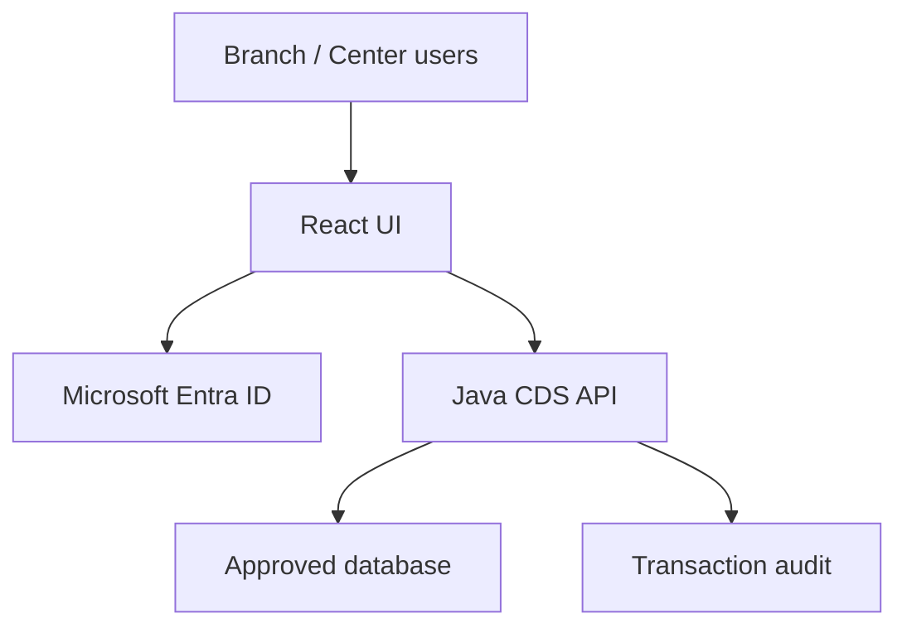

# CDS Hackathon — team playbook

ชุดเตรียมทีม 3 คนสำหรับโจทย์ Cash Delivery System modernization โดยใช้ **GitHub Copilot, Java, React/Node, Podman และ JMeter** เป็นเอกสารกับ skill templates พร้อมใช้บนเครื่องแข่งขัน ยังไม่มี application ที่รันได้หรือผลทดสอบจริง

> **ขอบเขตข้อมูลสาธารณะ:** Repo นี้เป็น playbook เตรียมงาน ไม่มี credentials, network config, app registration, DB schema, customer data หรือระบบภายในองค์กร กรุณาเก็บค่าเหล่านั้นในช่องทางที่องค์กรอนุญาตเท่านั้น

## เริ่มจากตรงไหน

1. อ่าน [runbook และตารางเวลา](docs/runbook.md) โดยเฉพาะ **60 นาทีก่อนแข่ง** และช่วง **17:30–18:00**
2. ในช่วง briefing ยืนยัน [brief และคำถามสำคัญ](docs/brief.md) ก่อนลงมือเขียน business rules
3. เปิด repository ใน IDE ที่องค์กรอนุญาตพร้อม GitHub Copilot Agent mode ตรวจว่า Copilot อ่าน [คำสั่งกลาง](.github/copilot-instructions.md) และ [skills](#skills-ที่แยกไว้) ได้
4. ให้ C เริ่ม [kickoff prompt](docs/prompts/00-kickoff.md) ตกลง API contract แล้วจึงให้ A/B เริ่มตาม prompt ของตน
5. บันทึกข้อสรุปใน [decisions](docs/decisions.md) และงาน AI ที่เกิดขึ้นจริงใน [AI usage log](docs/ai-usage.md)

> ภาพการแข่งขันที่ทีมมีระบุให้ใช้ **เครื่องบริษัทและ GitHub Copilot เท่านั้น** และส่งไฟล์ผ่าน SharePoint **ภายใน 18:00 เวลาไทย** หลัง 18:00 เตรียม demo/presentation ตามที่ผู้จัดอนุญาต โปรดตรวจคำยืนยันล่าสุดในวันแข่ง

## บทบาทและเส้นทางส่งงาน

| คน | รับผิดชอบ | Prompt เริ่มงาน | ส่งต่อให้ใคร |
|---|---|---|---|
| A | Java business API, persistence, security ใน `backend/` | [01-backend](docs/prompts/01-backend.md) | ส่ง API ที่ผ่าน smoke test ให้ C; แจ้ง contract change ก่อนแก้ |
| B | React UI ใน `frontend/` | [02-frontend](docs/prompts/02-frontend.md) | ส่ง flow ที่เชื่อม API ให้ C ตรวจเดโม |
| C | OpenAPI, AAD integration coordination, Podman, JMeter, docs | [00-kickoff](docs/prompts/00-kickoff.md) และ [03-integration](docs/prompts/03-integration.md) | เป็นเจ้าของ contract และ submission |

สาม API ที่โจทย์ระบุคือ **Cash Withdrawal Request**, **Cash Withdrawal History Inquiry**, และ **Cash Receipt Confirmation** คำว่า receipt ในที่นี้คือการยืนยัน *รับเงินสด* รูปแบบ endpoint, schema, limit และสถานะธุรกรรมต้องยืนยันตามมาตรฐานของผู้จัดก่อน

## Skills ที่แยกไว้

| Skill | ผู้ใช้หลัก | เรียกในช่วง | ผลลัพธ์ |
|---|---|---|---|
| [cds-contract](.github/skills/cds-contract/SKILL.md) | A, C | 10:00–10:30; 13:00–14:30 | contract, auth scope, amount, state, retry semantics |
| [cds-ui-review](.github/skills/cds-ui-review/SKILL.md) | B | 10:30–12:00; 13:00–14:30; rehearsal | form/history/receipt UI และสถานะผิดพลาด |
| [cds-verification](.github/skills/cds-verification/SKILL.md) | C, A | 14:30–17:00 | test matrix, ผลทดสอบจริง, JMeter evidence |
| [cds-architecture-defense](.github/skills/cds-architecture-defense/SKILL.md) | C, ทีม | 10:00–10:30; 16:00–17:00 | architecture diagram/ADR และคำตอบเรื่อง scaling |

GitHub Copilot รองรับ project skills ใน `.github/skills/<name>/SKILL.md` ตรวจใน IDE ว่า Agent mode พบและอ่านได้จริง หากการค้นหาอัตโนมัติไม่ทำงาน ให้สั่ง Copilot เปิดไฟล์ skill ตาม path ก่อนเริ่ม task

### UI UX Pro Max เป็นตัวเลือก

ใช้กับคน B เมื่อผู้จัดอนุญาต third-party skill และติดตั้งบนเครื่องบริษัทได้ ตรวจต้นทางที่ [UI UX Pro Max](https://github.com/nextlevelbuilder/ui-ux-pro-max-skill) ก่อน ระยะติดตั้ง/ตรวจไม่ควรเกิน 10 นาที หลังติดตั้งให้ตรวจไฟล์จริง: integration แบบ Copilot อาจอยู่ใน `.github/prompts/` และต้องเรียก `/ui-ux-pro-max` ตามรุ่นที่ติดตั้ง จึงไม่ควรสมมติว่ามันกลายเป็น native skill โดยอัตโนมัติ ถ้าใช้ไม่ได้ ให้ใช้ `cds-ui-review` ที่อยู่ใน repo นี้

```sh
npm view ui-ux-pro-max-cli version
# ตรวจแพ็กเกจและแทน VERSION ด้วยเวอร์ชันที่ทีมเลือก
npx ui-ux-pro-max-cli@VERSION init --ai copilot
```

คำสั่งตัวอย่างด้านบนต้องแทน `VERSION` ก่อนรัน และไม่ใช้ `--force` กับ repo ที่มีไฟล์ทีมอยู่แล้ว

## Milestones ที่ต้องตรวจ

| เวลาสิ้นสุด | ต้องเห็นอะไร |
|---|---|
| 10:30 | contract และ unknowns; ระบุ AAD/DB blocker |
| 12:00 | withdrawal + history เรียก API ได้อย่างน้อยรอบแรก |
| 14:30 | receipt, branch authorization, retry/concurrency strategy |
| 16:00 | integrated tests และ JMeter รอบเล็กพร้อมตัวเลขจริง |
| 17:00 | เปิดระบบใหม่จากคำสั่งที่เขียนไว้และซ้อม demo ได้ |
| 17:50 | ตรวจ submission บน SharePoint เสร็จ เผื่อ 10 นาที |

ตารางรายขั้นตอน, skill ที่ใช้, fallback และคนรับผิดชอบอยู่ใน [runbook](docs/runbook.md) เวลาเป็นแผนจำลองและปรับตาม Q&A จริง

## เอกสารที่ทีมกรอกขณะแข่ง

- [Decisions และ assumptions](docs/decisions.md)
- [Test matrix](docs/test-matrix.md)
- [Performance report](docs/performance.md)
- [AI usage evidence](docs/ai-usage.md)
- [Submission checklist](docs/submission-checklist.md)

ผลทุกอย่างเริ่มเป็น `TBD` หรือ `Not run` โดยตั้งใจ อย่ากรอกคะแนน coverage, throughput หรือเวลาที่ AI ช่วยประหยัดโดยไม่มีการวัด

## Architecture เริ่มต้นที่เสนอ



เริ่มด้วย backend Java หนึ่งชุดที่แบ่ง business modules และ datastore ที่ผู้จัดอนุญาต มีการตรวจ access token/สิทธิ์ที่ API และบันทึก audit ตาม transaction ผลของ JMeter และ query/pool metrics จะเป็นเหตุผลในการปรับ topology เพิ่มเติม การมี 3 endpoints ไม่ได้บังคับว่าต้องมี 3 services

## ที่มาและการเปิดเผย

ชุดตั้งต้นนี้จัดทำด้วย ChatGPT **ก่อนการแข่งขัน** และนำมาใส่ repo สาธารณะตามคำขอของเจ้าของ repo ให้ตรวจว่าการใช้ preparation materials และ third-party skills ผ่านกติกาจริงก่อนนำไปใช้ระหว่างแข่ง บันทึกงานที่ **GitHub Copilot** ทำในวันแข่งตามจริงแยกใน `docs/ai-usage.md`

เอกสารเทคนิค: [GitHub agent skills](https://docs.github.com/en/copilot/how-tos/copilot-on-github/customize-copilot/customize-cloud-agent/add-skills), [GitHub customization](https://docs.github.com/en/copilot/reference/customization-cheat-sheet), [Podman Compose](https://docs.podman.io/en/latest/markdown/podman-compose.1.html), [JMeter CLI](https://jmeter.apache.org/usermanual/get-started.html), [Microsoft PKCE flow](https://learn.microsoft.com/en-us/entra/identity-platform/v2-oauth2-auth-code-flow)
