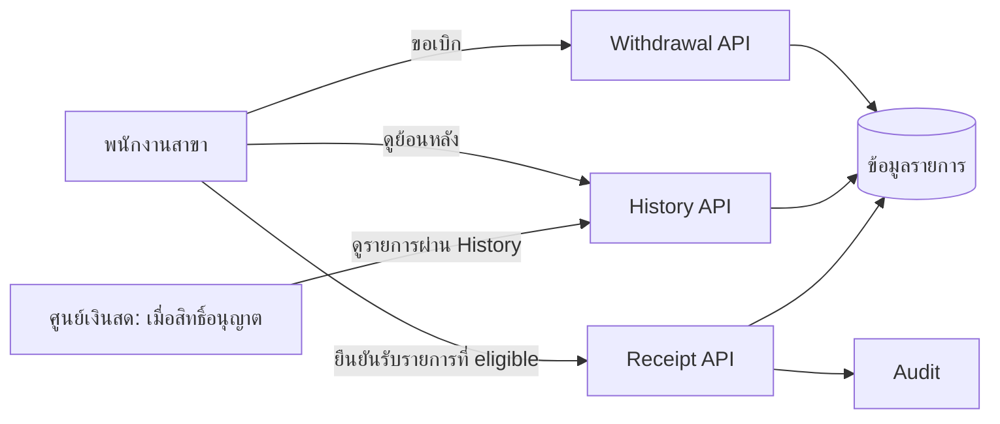

# คู่มือเข้าใจ flow และตอบคำถามกรรมการ

เอกสารนี้อธิบายภาพง่าย ๆ ก่อนลงรายละเอียดเทคนิค. ทุกสถานะ/กฎจำนวนเงินในตัวอย่างเป็น **สมมติฐานเพื่ออธิบาย**; ในวันแข่งให้ใช้คำตอบผู้จัดใน [decisions](decisions.md)

## เรื่องเล่าหนึ่งรายการ

**จุดที่คนมักสับสน:** การมีเพียง 3 APIs ไม่ได้แปลว่ามีขั้นอนุมัติและจัดส่งครบ. `REQUESTED → ... → ELIGIBLE → RECEIVED` เป็นภาพอธิบาย; ชื่อ state และวิธีเปลี่ยนไป eligible ต้องยืนยัน. หากไม่มีกระบวนการนี้ในโจทย์/เวลา ให้ seed รายการ eligible ที่ระบุว่าเป็น fixture แล้วสาธิต Receipt แยกจากรายการที่เพิ่งขอเบิก. คำว่า Receipt คือ *ยืนยันรับเงินสด* ไม่ใช่ใบเสร็จรับเงินจากลูกค้า

## คำศัพท์ที่ต้องพูดให้เป็น

| คำ | อธิบายสั้น ๆ | ทำไมสำคัญ |
|---|---|---|
| API contract | ข้อตกลงหน้าตาข้อมูลและ error | A/B ทำงานคู่ขนานโดยไม่เดา field |
| Branch scope | สิทธิ์ดู/ทำรายการตามสาขา | เปลี่ยน ID ใน URL ก็ข้ามสาขาไม่ได้ |
| AAD/Entra | ระบบยืนยันตัวผู้ใช้ | Login สำเร็จยังไม่พอ; API ต้องตรวจ token/สิทธิ์ |
| Idempotency key | ป้ายกำกับคำขอเพื่อให้ส่งซ้ำแล้วได้ผลเดิม | เน็ตหลุดหลังกดรับเงินจะไม่ทำซ้ำ |
| Transaction | บันทึกการเปลี่ยนสถานะกับ audit ให้ไปด้วยกัน | ลดรายการครึ่ง ๆ กลาง ๆ |
| Concurrency | สองคน/สองคำขอทำพร้อมกัน | รับเงินได้เพียงครั้งเดียวตามกฎ |
| Fixture | ข้อมูลสังเคราะห์ที่ตั้งไว้เพื่อทดสอบ/เดโม | แสดง receipt แม้ approval/dispatch ยังไม่ได้ทำ |
| p95 | 95% ของคำขอในชุดทดสอบเร็วไม่เกินค่านี้ | ต้องรายงานพร้อม workload/เครื่อง/error |
| Strangler approach | ย้ายความสามารถจากระบบเดิมทีละส่วน | ไม่ต้องอ้างว่ายกเครื่องทั้ง CDS ในวันเดียว |

## เหตุการณ์สำคัญ 5 แบบ

1. **สร้างคำขอปกติ:** API ตรวจ token → หา branch จากสิทธิ์ฝั่ง server → ตรวจจำนวนเงิน/กฎ → บันทึก request กับ audit → ตอบ reference. History ของสาขานั้นต้องเห็นรายการหลัง reload
2. **ไม่มีสิทธิ์:** เปลี่ยนเป็น branch หรือ ID ของคนอื่นใน request ก็ไม่เห็นและไม่เปลี่ยนข้อมูล. ซ่อนปุ่มใน React ไม่ใช่หลักฐานว่าปลอดภัย
3. **กดยืนยันซ้ำ:** key เดิม + payload เดิมให้ผลลัพธ์ตาม retry contract โดยไม่มีผลการเงินซ้ำ; key เดิม + payload ใหม่ต้อง conflict. การกดซ้ำพร้อมกันต้องมีเพียงหนึ่ง transition
4. **เน็ตหลุดหลัง commit:** ผู้ใช้ไม่รู้ว่ารับเงินสำเร็จหรือยัง. UI แสดง “ยังไม่ทราบผล” และใช้ key เดิมตรวจ/ส่งซ้ำตาม contract แทนสร้างรายการใหม่
5. **DB ล้มเหลวกลางทาง:** ข้อมูลรายการ/สถานะ/audit ต้องไม่ค้างครึ่งทาง. Test หรือหลักฐานที่รันจริงจึงเป็นตัวพิสูจน์

## ถ้ากรรมการถาม

| คำถาม | คำตอบที่ยึดหลักฐาน |
|---|---|
| ทำไมไม่สร้าง 3 microservices? | ตอนนี้ 3 operations อยู่โดเมนธุรกรรมเดียวและต้องรักษา transaction; Java backend ชุดเดียวทำให้ทดสอบและรันง่าย. แยกเมื่อมีขอบเขต/โหลดที่วัดได้ |
| Center เห็นรายการอย่างไร? | ใช้ History API เดียวกับ role/scope ที่ contract อนุญาต; หากผู้จัดกำหนดต่าง ให้ทำตามนั้น. แสดงผล test cross-branch |
| ทำไม request ที่เพิ่งสร้างยืนยันรับไม่ได้ทันที? | เพราะสถานะต้อง eligible ตามกฎ. หากขั้นอนุมัติ/จัดส่งไม่อยู่ใน 3 APIs เราใช้ fixture ที่บอกตรง ๆ |
| AAD เสร็จจริงไหม? | ชี้ login จริงและ token/API authorization ที่ทดสอบ; ถ้าไม่มี access ให้บอก blocker และ fallback ตรง ๆ |
| รองรับ 1,980 ผู้ใช้ไหม? | 1,980 เป็นจำนวนบัญชี ไม่ใช่ simultaneous load. แสดง JMeter workload, latency/error และข้อจำกัดของเครื่อง |
| AI ทำอะไร? | เปิด prompt, diff ก่อน/หลังที่คนแก้, test และบันทึก `ai-usage.md`; ไม่อ้างเวลาที่ประหยัดโดยไม่วัด |
| ระบบเดิมจะย้ายอย่างไร? | ใช้ [migration map](legacy-modernization.md): เลือกสาม flow ก่อน กำหนดเจ้าของข้อมูล/adapter/rollback หลังมี schema และสิทธิ์จริง |

## สรุป 30 วินาทีไว้เปิดเดโม

> เรานำสามธุรกรรมหลักของ CDS มาทำเป็น API และหน้าจอใหม่ โดยเน้นความถูกต้องของเงิน สิทธิ์สาขา และการกดซ้ำ. เดโมนี้แสดงทั้งกรณีสำเร็จและถูกปฏิเสธ พร้อมหลักฐาน API, audit, tests และข้อจำกัดที่ยังไม่ได้เชื่อมระบบเดิม. ส่วนงานอื่นของ CDS มีแผนย้ายทีละส่วนหลังการแข่งขัน
